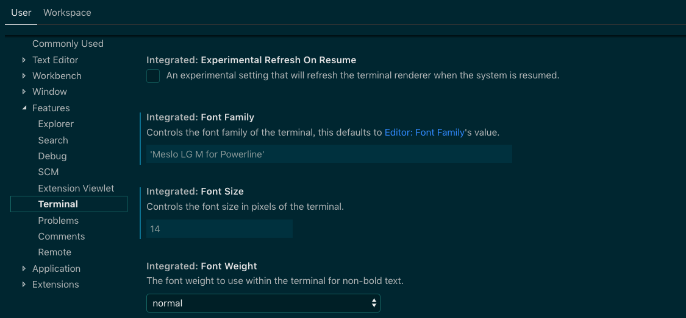

# VSCODE 终端切换字体

新MacOS发布了Catalina新版本，Terminal默认的shell变成了zsh，尝试安装了Oh My Zsh，但是OMZ的箭头字体在VSCODE的终端并不能正常显示。

打开VSCODE的Settings，选择Features菜单中的Terminal选项，定位到“Integrated:Font Family”,填写支持箭头的字体，比如我安装的字体'Meslo LG M for Powerline'。

修改完成后乱码就可以正常显示。